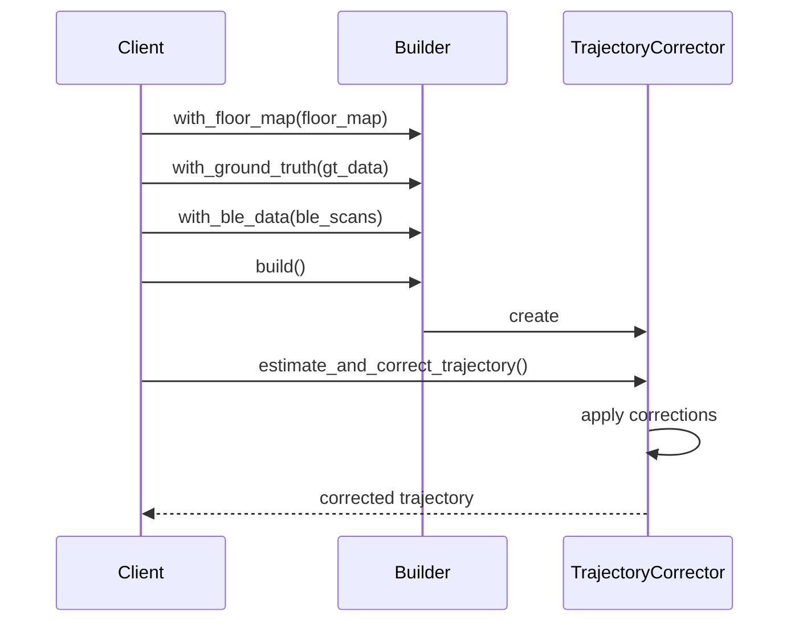

```mermaid

sequenceDiagram
    participant C as Client
    participant B as Builder
    participant T as TrajectoryCorrector
    
    C->>B: with_floor_map(floor_map)
    C->>B: with_ground_truth(gt_data)
    C->>B: with_ble_data(ble_scans)
    C->>B: build()
    B->>T: create
    C->>T: estimate_and_correct_trajectory()
    T->>T: apply corrections
    T-->>C: corrected trajectory

```