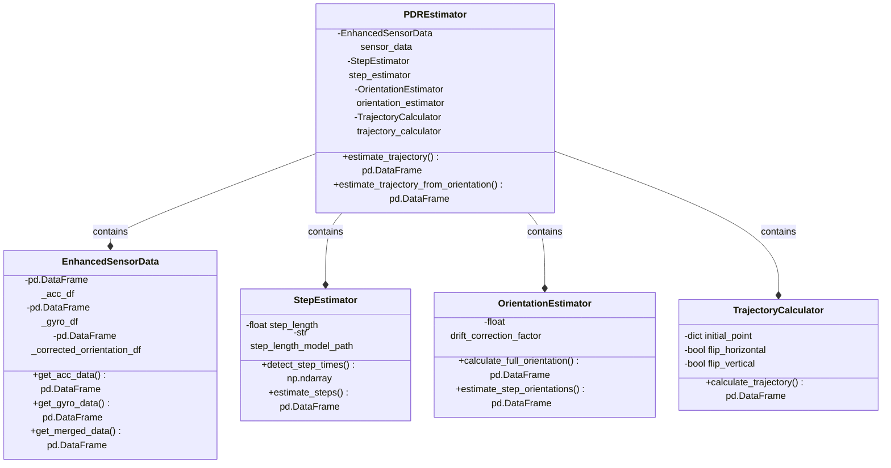

```mermaid
%%{init: {'theme': 'default', 'themeVariables': { 'fontSize': '20px', 'fontFamily': 'arial' }}}%%

classDiagram
    class PDREstimator {
        -EnhancedSensorData sensor_data
        -StepEstimator step_estimator
        -OrientationEstimator orientation_estimator
        -TrajectoryCalculator trajectory_calculator
        +estimate_trajectory() pd.DataFrame
        +estimate_trajectory_from_orientation() pd.DataFrame
    }

    class StepEstimator {
        -float step_length
        -str step_length_model_path
        +detect_step_times() np.ndarray
        +estimate_steps() pd.DataFrame
    }

    class OrientationEstimator {
        -float drift_correction_factor
        +calculate_full_orientation() pd.DataFrame
        +estimate_step_orientations() pd.DataFrame
    }

    class TrajectoryCalculator {
        -dict initial_point
        -bool flip_horizontal
        -bool flip_vertical
        +calculate_trajectory() pd.DataFrame
    }

    class EnhancedSensorData {
        -pd.DataFrame _acc_df
        -pd.DataFrame _gyro_df
        -pd.DataFrame _corrected_orrientation_df
        +get_acc_data() pd.DataFrame
        +get_gyro_data() pd.DataFrame
        +get_merged_data() pd.DataFrame
    }

    PDREstimator --* EnhancedSensorData : contains
    PDREstimator --* StepEstimator : contains
    PDREstimator --* OrientationEstimator : contains
    PDREstimator --* TrajectoryCalculator : contains

```

