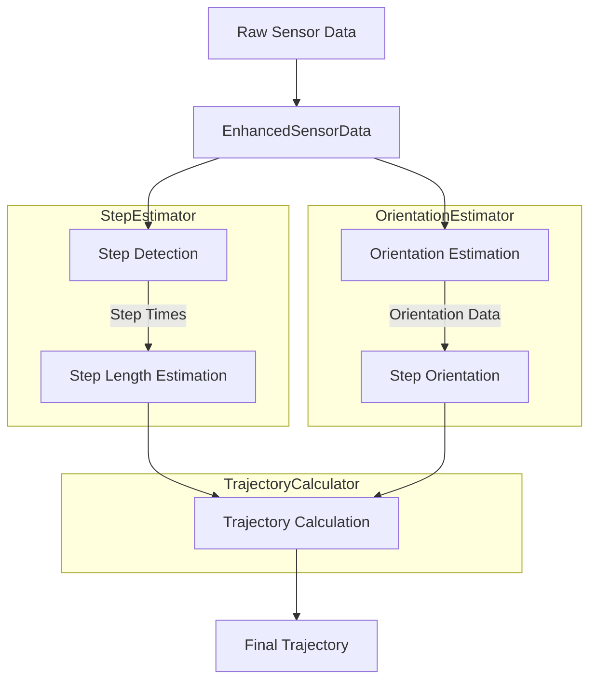

```mermaid
flowchart TD
    A[Raw Sensor Data] --> B[EnhancedSensorData]
    B --> C[Step Detection]
    B --> D[Orientation Estimation]
    
    C -->|Step Times| E[Step Length Estimation]
    D -->|Orientation Data| F[Step Orientation]
    
    E --> G[Trajectory Calculation]
    F --> G
    
    G --> I[Final Trajectory]

    subgraph StepEstimator
    C
    E
    end

    subgraph OrientationEstimator
    D
    F
    end

    subgraph TrajectoryCalculator
    G
    end
```