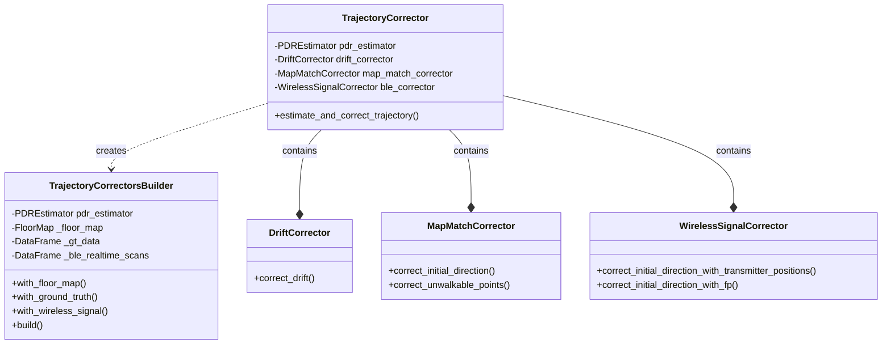

```mermaid
classDiagram
    class TrajectoryCorrector {
        -PDREstimator pdr_estimator
        -DriftCorrector drift_corrector
        -MapMatchCorrector map_match_corrector
        -WirelessSignalCorrector ble_corrector
        +estimate_and_correct_trajectory()
    }

    class TrajectoryCorrectorsBuilder {
        -PDREstimator pdr_estimator
        -FloorMap _floor_map
        -DataFrame _gt_data
        -DataFrame _ble_realtime_scans
        +with_floor_map()
        +with_ground_truth()
        +with_wireless_signal()
        +build()
    }

    class DriftCorrector {
        +correct_drift()
    }

    class MapMatchCorrector {
        +correct_initial_direction()
        +correct_unwalkable_points()
    }

    class WirelessSignalCorrector {
        +correct_initial_direction_with_transmitter_positions()
        +correct_initial_direction_with_fp()
    }

    TrajectoryCorrector ..> TrajectoryCorrectorsBuilder : creates
    TrajectoryCorrector --* DriftCorrector : contains
    TrajectoryCorrector --* MapMatchCorrector : contains
    TrajectoryCorrector --* WirelessSignalCorrector : contains

```
