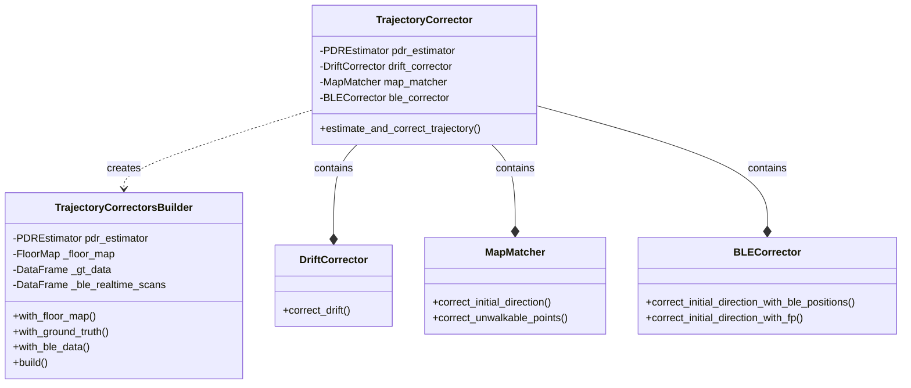

```mermaid
classDiagram
    class TrajectoryCorrector {
        -PDREstimator pdr_estimator
        -DriftCorrector drift_corrector
        -MapMatcher map_matcher
        -BLECorrector ble_corrector
        +estimate_and_correct_trajectory()
    }

    class TrajectoryCorrectorsBuilder {
        -PDREstimator pdr_estimator
        -FloorMap _floor_map
        -DataFrame _gt_data
        -DataFrame _ble_realtime_scans
        +with_floor_map()
        +with_ground_truth()
        +with_ble_data()
        +build()
    }

    class DriftCorrector {
        +correct_drift()
    }

    class MapMatcher {
        +correct_initial_direction()
        +correct_unwalkable_points()
    }

    class BLECorrector {
        +correct_initial_direction_with_ble_positions()
        +correct_initial_direction_with_fp()
    }

    TrajectoryCorrector ..> TrajectoryCorrectorsBuilder : creates
    TrajectoryCorrector --* DriftCorrector : contains
    TrajectoryCorrector --* MapMatcher : contains
    TrajectoryCorrector --* BLECorrector : contains

```